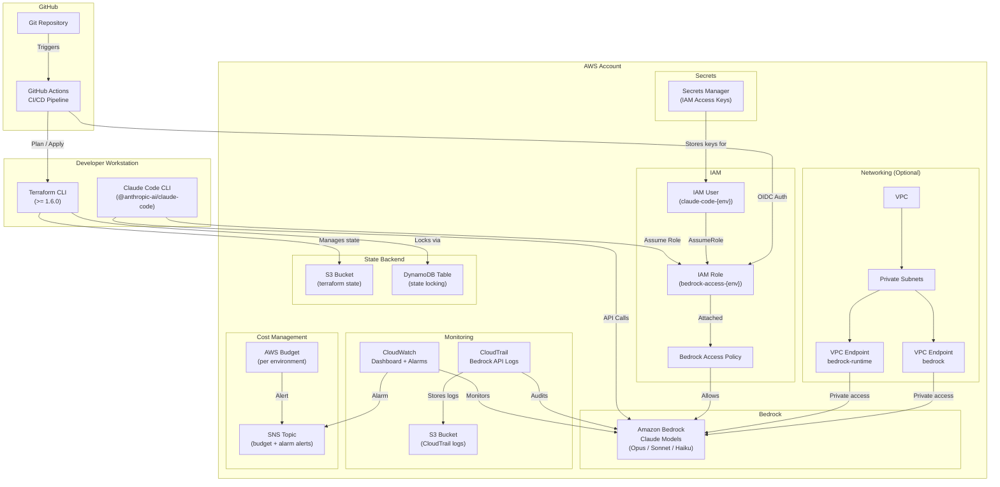
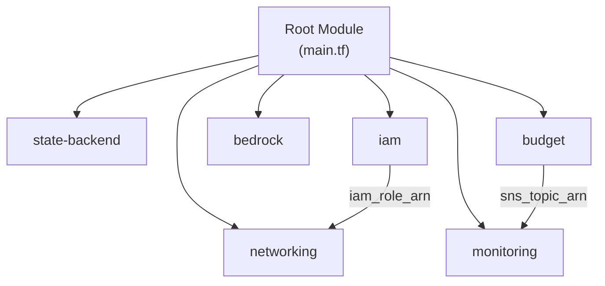
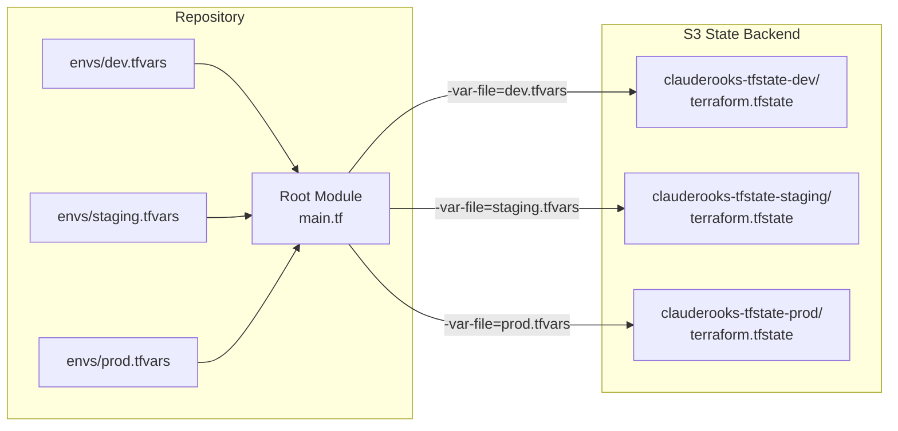
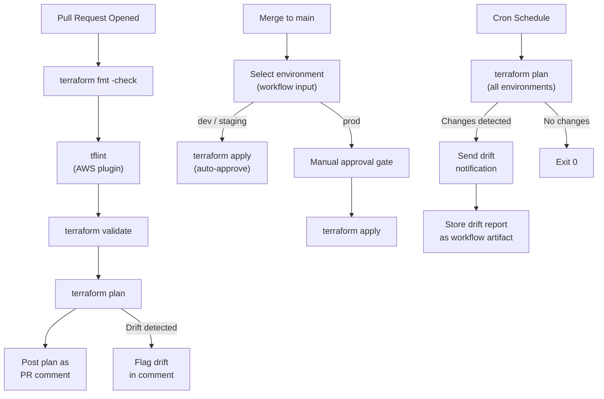

# High-Level Design Document — clauderooks

## 1. Introduction

**clauderooks** is a Terraform infrastructure-as-code project that provisions and manages all AWS resources required to run [Claude Code CLI](https://docs.anthropic.com/en/docs/claude-code) backed by Amazon Bedrock. The project covers IAM identity management, Bedrock model access, optional private networking via VPC endpoints, cost management, observability, and multi-environment support (dev, staging, prod).

This document describes the overall architecture, module responsibilities, security model, multi-environment strategy, CI/CD pipeline, and key design decisions.

---

## 2. Architecture Overview

### 2.1 System Context Diagram



### 2.2 Component Interaction Flow

1. **Developer** retrieves IAM credentials from Secrets Manager and configures Claude Code CLI environment variables.
2. **Claude Code CLI** assumes the IAM role and makes Bedrock API calls (optionally routed through VPC endpoints).
3. **Terraform CLI** (locally or via GitHub Actions) manages all infrastructure, storing state in S3 with DynamoDB locking.
4. **GitHub Actions** validates PRs (fmt, lint, validate, plan), applies on merge, and runs scheduled drift detection.
5. **CloudWatch** monitors Bedrock API metrics; **CloudTrail** audits all API calls; **AWS Budgets** tracks spending — all alerting through SNS.

---

## 3. Module Descriptions and Responsibilities

The project is organized as six composable Terraform modules under `modules/`, each owning a single infrastructure concern.

### 3.1 Module Dependency Graph



### 3.2 Module Summary

| Module | Directory | Responsibility | Key Resources |
|---|---|---|---|
| **state-backend** | `modules/state-backend/` | Provisions S3 bucket (versioned, encrypted, private) and DynamoDB table for Terraform remote state storage and locking. | `aws_s3_bucket`, `aws_s3_bucket_versioning`, `aws_s3_bucket_server_side_encryption_configuration`, `aws_s3_bucket_public_access_block`, `aws_dynamodb_table` |
| **iam** | `modules/iam/` | Creates a dedicated IAM user for Claude Code CLI, an assumable IAM role with Bedrock access policy, generates access keys, and stores credentials in Secrets Manager with rotation. | `aws_iam_user`, `aws_iam_role`, `aws_iam_policy`, `aws_iam_role_policy_attachment`, `aws_iam_user_policy`, `aws_iam_access_key`, `aws_secretsmanager_secret`, `aws_secretsmanager_secret_version` |
| **bedrock** | `modules/bedrock/` | Configures Amazon Bedrock model access for specified Claude models (Opus, Sonnet, Haiku) and enables invocation logging. Accepts a configurable list of model identifiers per environment. | `aws_bedrock_model_invocation_logging_configuration`, data sources for model ARN resolution |
| **networking** | `modules/networking/` | Creates a VPC with private subnets and VPC endpoints for private Bedrock access. Conditionally provisioned via `enable_vpc_endpoints` feature flag. Endpoint policies restrict access to the dedicated IAM role. | `aws_vpc`, `aws_subnet`, `aws_security_group`, `aws_vpc_endpoint` (runtime + control plane) |
| **monitoring** | `modules/monitoring/` | Sets up a CloudWatch dashboard for Bedrock metrics (invocation count, latency, errors), CloudWatch alarms for error rates, and a CloudTrail trail for auditing all Bedrock API calls. Logs stored in an encrypted S3 bucket. | `aws_cloudwatch_dashboard`, `aws_cloudwatch_metric_alarm`, `aws_cloudtrail`, `aws_s3_bucket` (CloudTrail logs) |
| **budget** | `modules/budget/` | Creates an AWS Budget with a configurable monthly spending limit and alert notifications at 50%, 80%, and 100% thresholds. Alerts delivered via SNS to configurable email addresses. Filters by cost allocation tags. | `aws_budgets_budget`, `aws_sns_topic`, `aws_sns_topic_subscription` |

### 3.3 Root Module Orchestration

The root module (`main.tf`) instantiates all child modules and wires inter-module dependencies:

- **state-backend**, **iam**, **bedrock**, and **budget** have no upstream module dependencies.
- **networking** depends on **iam** (`iam_role_arn` for VPC endpoint policy) and is conditionally created via `count`.
- **monitoring** depends on **budget** (`sns_topic_arn` for alarm notifications).

Common tags and naming conventions are defined in `locals.tf` and propagated to all modules via the `tags` input variable.

---

## 4. Multi-Environment Strategy

The project supports three isolated environments: **dev**, **staging**, and **prod**.

### 4.1 Isolation Approach

Environments are isolated using **separate state files** (not Terraform workspaces) to avoid workspace pitfalls and ensure complete independence.



### 4.2 Environment Differentiation

| Aspect | dev | staging | prod |
|---|---|---|---|
| **Monthly budget** | $50 | $200 | $1,000 |
| **VPC endpoints** | Disabled (cost savings) | Enabled | Enabled |
| **Session duration** | 3,600s (1h) | 7,200s (2h) | 3,600s (1h) |
| **Secret rotation** | 90 days | 60 days | 30 days |
| **Bedrock models** | Sonnet only | Sonnet + Haiku | Sonnet + Haiku + Opus |
| **CloudTrail retention** | 90 days (default) | 90 days (default) | 365 days |
| **Alarm threshold** | 5 errors (default) | 5 errors (default) | 3 errors |
| **CI/CD apply** | Auto-approve | Auto-approve | Manual approval gate |

### 4.3 Resource Naming Convention

All resources are prefixed with `{project_name}-{environment}` (e.g., `clauderooks-dev`, `clauderooks-prod`) to prevent naming collisions across environments. This prefix is computed in `locals.tf`:

```hcl
locals {
  name_prefix = "${var.project_name}-${var.environment}"
}
```

### 4.4 Tagging Strategy

Every resource carries a consistent tag set propagated from the root module:

| Tag | Value | Purpose |
|---|---|---|
| `Project` | `clauderooks` | Cost allocation and identification |
| `Environment` | `dev` / `staging` / `prod` | Environment identification |
| `ManagedBy` | `terraform` | Distinguishes IaC-managed resources |
| `Owner` | `clauderooks-team` (configurable) | Ownership tracking |

Tags are defined in `locals.tf` and passed to every module via the `tags` variable. Modules may merge additional resource-specific tags as needed.

---

## 5. Security Model

### 5.1 IAM — Least-Privilege Access

```
┌─────────────────────────────────────────────────────────┐
│                    IAM Architecture                      │
│                                                          │
│  IAM User (claude-code-{env})                           │
│    └─ User Policy: sts:AssumeRole ONLY                  │
│                                                          │
│  IAM Role (bedrock-access-{env})                        │
│    ├─ Trust Policy: allows IAM User to assume            │
│    ├─ Bedrock Access Policy: scoped model permissions    │
│    └─ Max Session Duration: configurable per env         │
│                                                          │
│  Secrets Manager                                         │
│    └─ Stores IAM access keys (auto-rotation enabled)     │
└─────────────────────────────────────────────────────────┘
```

- The IAM **user** has a single permission: `sts:AssumeRole` for the dedicated role. No direct Bedrock access.
- The IAM **role** carries the Bedrock access policy. All Bedrock API calls require role assumption, enforcing session limits and auditability.
- IAM access keys are generated by Terraform and stored in **Secrets Manager** — never exposed in Terraform output or logs (`sensitive = true`).
- Automatic secret rotation is configured with a per-environment interval (30–90 days).

### 5.2 VPC Endpoints — Private Network Access

When `enable_vpc_endpoints = true` (staging and prod by default):

- A dedicated **VPC** with private subnets is created.
- **VPC endpoints** for `bedrock-runtime` and `bedrock` control plane route API traffic entirely within the AWS network — no public internet traversal.
- **Endpoint policies** restrict access to the dedicated IAM role only, preventing unauthorized use of the endpoints.
- A **security group** allows only HTTPS (port 443) inbound traffic to the endpoints.

When disabled (dev by default), Bedrock API calls use public endpoints to reduce cost.

### 5.3 Encryption

| Data | Encryption Method | Details |
|---|---|---|
| Terraform state (S3) | AES-256 server-side encryption | Configured via `aws_s3_bucket_server_side_encryption_configuration` |
| Terraform state (S3) | Public access blocked | All four public access block settings enabled |
| CloudTrail logs (S3) | Server-side encryption | Dedicated encrypted bucket with lifecycle rules |
| Secrets Manager | AWS-managed encryption | Default KMS encryption for stored secrets |
| DynamoDB lock table | AWS-managed encryption | Default encryption at rest |

### 5.4 CI/CD Authentication

GitHub Actions uses **OIDC-based authentication** to AWS — no static access keys stored in GitHub. The pipeline assumes the IAM role via OIDC federation, inheriting the same least-privilege permissions.

### 5.5 Audit Trail

- **CloudTrail** captures all Bedrock API calls with configurable log retention (90–365 days).
- **CloudWatch alarms** trigger on error rate thresholds, sending notifications via SNS.
- All resources are tagged for cost allocation and ownership tracking.

---

## 6. CI/CD Pipeline Flow

The project uses **GitHub Actions** with three workflow files:

### 6.1 Pipeline Overview



### 6.2 Workflow Descriptions

| Workflow | File | Trigger | Purpose |
|---|---|---|---|
| **PR Validation** | `terraform-pr.yml` | Pull request | Runs fmt check, tflint, validate, and plan. Posts plan output as a PR comment. Flags drift if detected. Uses OIDC auth. |
| **Apply** | `terraform-apply.yml` | Merge to main | Applies Terraform changes for the selected environment. Auto-approves for dev/staging; requires manual approval for prod. Uses OIDC auth. |
| **Drift Detection** | `terraform-drift.yml` | Cron schedule | Runs `terraform plan` against all environments. Sends notification and stores drift report as artifact when changes are detected. Exits non-zero on drift. |

### 6.3 Pipeline Stages

**PR Validation Pipeline:**
1. `terraform fmt -check` — ensures consistent formatting
2. `tflint` — lints for best practices and deprecated features
3. `terraform validate` — validates syntax and provider schema
4. `terraform plan` — generates execution plan for the target environment
5. Post plan output as PR comment (flags drift if detected)

**Apply Pipeline:**
1. Select environment (dev, staging, or prod) via workflow input
2. `terraform init` with environment-specific backend config
3. `terraform plan` — generate plan
4. Manual approval gate (prod only)
5. `terraform apply` — apply changes

**Drift Detection Pipeline:**
1. Run on cron schedule against all environments
2. `terraform plan` — detect configuration drift
3. If drift detected: send notification, store report as artifact, exit non-zero
4. If no drift: exit cleanly

---

## 7. Key Design Decisions

| # | Decision | Choice | Rationale |
|---|---|---|---|
| 1 | **State isolation** | Separate state files per environment (not workspaces) | Avoids Terraform workspace pitfalls; each environment has its own S3 key path and backend config, ensuring complete independence. |
| 2 | **IAM model** | User + assumable Role | Claude Code CLI needs long-lived access keys (stored in Secrets Manager), but actual Bedrock access goes through a role with session limits and auditability. |
| 3 | **VPC endpoints** | Optional via feature flag (`enable_vpc_endpoints`) | Not all environments need private access; dev can use public endpoints to reduce cost. Staging and prod enable endpoints for security. |
| 4 | **CI/CD platform** | GitHub Actions | Most common CI/CD platform for open-source Terraform projects; built-in OIDC support for AWS authentication. |
| 5 | **CI/CD authentication** | OIDC federation (no static keys) | Eliminates the risk of leaked long-lived credentials in CI/CD. Role assumption provides scoped, time-limited access. |
| 6 | **Linting tool** | tflint | Industry standard for Terraform linting with AWS plugin support for provider-specific checks. |
| 7 | **Module structure** | Flat modules under `modules/` | Simple and discoverable; avoids nested module complexity while keeping each concern isolated. |
| 8 | **Terraform version** | >= 1.6.0 | Required for the `terraform test` framework and modern validation features. |
| 9 | **AWS provider version** | >= 5.0 | Required for Bedrock resource support in the AWS provider. |
| 10 | **Secret management** | Secrets Manager with auto-rotation | Keeps IAM access keys out of Terraform state output and logs. Rotation interval is configurable per environment (30–90 days). |
| 11 | **Budget alerting** | Three thresholds (50%, 80%, 100%) | Provides early warning at 50%, escalation at 80%, and breach notification at 100% — standard cost management practice. |
| 12 | **Monitoring approach** | CloudWatch + CloudTrail | CloudWatch provides real-time metrics and alarms; CloudTrail provides audit logging. Both are native AWS services with no additional cost for basic usage. |
| 13 | **Alarm notification routing** | Shared SNS topic from budget module | The budget module creates the SNS topic; the monitoring module reuses it for alarm notifications, avoiding duplicate topics and consolidating alert delivery. |

---

## 8. Directory Structure

```
clauderooks/
├── main.tf                          # Root module — orchestrates all child modules
├── variables.tf                     # Root input variables with validation
├── outputs.tf                       # Root outputs from all modules
├── versions.tf                      # Terraform >= 1.6.0, AWS provider >= 5.0
├── providers.tf                     # AWS provider with default tags
├── locals.tf                        # Common tags and naming prefix
├── envs/
│   ├── dev.tfvars                   # Dev environment variables
│   ├── staging.tfvars               # Staging environment variables
│   └── prod.tfvars                  # Prod environment variables
├── modules/
│   ├── state-backend/               # S3 + DynamoDB for remote state
│   ├── iam/                         # IAM user, role, policy, Secrets Manager
│   ├── bedrock/                     # Bedrock model access and logging
│   ├── networking/                  # VPC, subnets, VPC endpoints (optional)
│   ├── monitoring/                  # CloudWatch, CloudTrail, alarms
│   └── budget/                      # AWS Budgets, SNS alerts
├── tests/                           # Terraform test files (.tftest.hcl)
├── .github/workflows/
│   ├── terraform-pr.yml             # PR validation pipeline
│   ├── terraform-apply.yml          # Apply pipeline (merge to main)
│   └── terraform-drift.yml          # Scheduled drift detection
└── docs/
    ├── README.md                    # Project README with CLI setup guide
    ├── HLD.md                       # This document
    └── LLD.md                       # Low-Level Design document
```

---

## 9. Requirements Traceability

| Requirement | Section |
|---|---|
| 14.1 — HLD stored in `docs/` | This document |
| 14.2 — Architecture overview diagram | Section 2.1 |
| 14.3 — Module descriptions and responsibilities | Section 3 |
| 14.4 — Multi-environment strategy | Section 4 |
| 14.5 — Security model (IAM, VPC endpoints, encryption) | Section 5 |
| 14.6 — CI/CD pipeline flow | Section 6 |
| 14.7 — Key design decisions with rationale | Section 7 |
