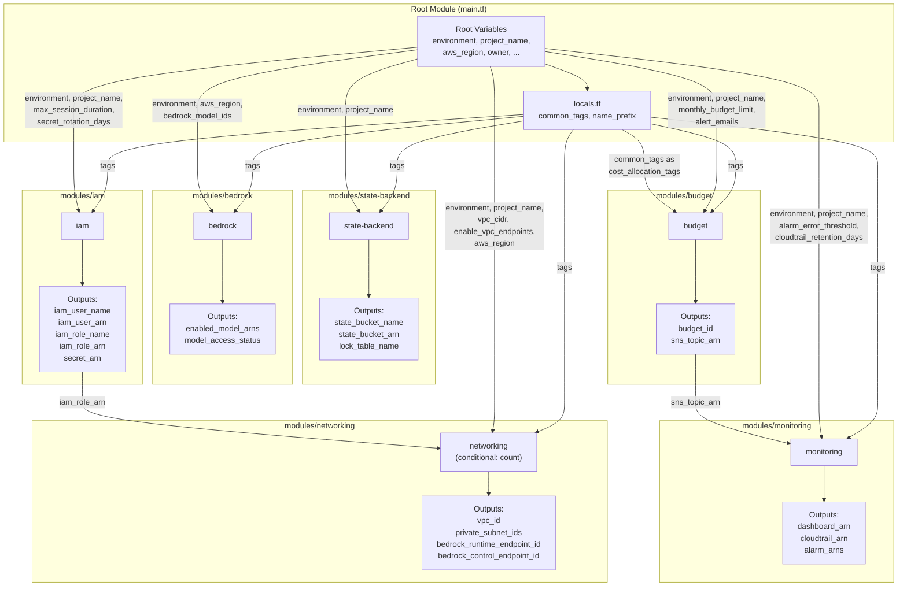
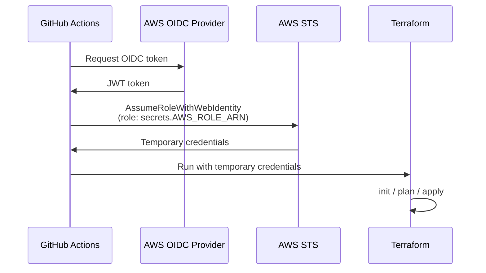

# Low-Level Design Document — clauderooks

## 1. Introduction

This Low-Level Design (LLD) document provides a detailed implementation reference for the **clauderooks** Terraform project. It covers every Terraform resource within each module, all input variables with types and constraints, all outputs, inter-module data flows, state backend configuration, and CI/CD pipeline stages.

For the high-level architecture overview, module responsibilities, and design decisions, see [HLD.md](./HLD.md).

---

## 2. Module Detailed Resource Descriptions

### 2.1 State Backend Module (`modules/state-backend/`)

**Purpose**: Provisions the S3 bucket and DynamoDB table used for Terraform remote state storage and locking.

| Resource | Terraform Type | Purpose |
|----------|---------------|---------|
| `aws_s3_bucket.state` | `aws_s3_bucket` | S3 bucket for storing Terraform state files. Named `{project_name}-tfstate-{environment}`. |
| `aws_s3_bucket_versioning.state` | `aws_s3_bucket_versioning` | Enables versioning on the state bucket so previous state versions can be recovered. |
| `aws_s3_bucket_server_side_encryption_configuration.state` | `aws_s3_bucket_server_side_encryption_configuration` | Configures AES-256 server-side encryption on all objects in the state bucket. |
| `aws_s3_bucket_public_access_block.state` | `aws_s3_bucket_public_access_block` | Blocks all public access (ACLs, policies, public buckets) on the state bucket. |
| `aws_dynamodb_table.lock` | `aws_dynamodb_table` | DynamoDB table for Terraform state locking. Uses `LockID` (String) as the hash key. PAY_PER_REQUEST billing mode. Named `{project_name}-tflock-{environment}`. |

---

### 2.2 IAM Module (`modules/iam/`)

**Purpose**: Creates the IAM user, role, policy, access keys, and Secrets Manager secret for Claude Code CLI Bedrock access.

| Resource | Terraform Type | Purpose |
|----------|---------------|---------|
| `data.aws_caller_identity.current` | `aws_caller_identity` (data) | Retrieves the current AWS account ID for use in policies. |
| `data.aws_partition.current` | `aws_partition` (data) | Retrieves the current AWS partition (e.g., `aws`, `aws-cn`). |
| `aws_iam_user.claude_code` | `aws_iam_user` | Dedicated IAM user for Claude Code CLI. Named `claude-code-{environment}`. |
| `aws_iam_role.bedrock_access` | `aws_iam_role` | IAM role with a trust policy allowing the dedicated user to assume it. Named `{project_name}-{environment}-bedrock-access`. Configurable `max_session_duration`. |
| `aws_iam_policy.bedrock_access` | `aws_iam_policy` | Custom IAM policy granting `bedrock:*` on all resources. Named `{project_name}-{environment}-bedrock-access`. |
| `aws_iam_role_policy_attachment.bedrock_access` | `aws_iam_role_policy_attachment` | Attaches the Bedrock access policy to the IAM role (not the user). |
| `aws_iam_user_policy.assume_role_only` | `aws_iam_user_policy` | Inline policy on the IAM user allowing only `sts:AssumeRole` for the Bedrock access role. |
| `aws_iam_access_key.claude_code` | `aws_iam_access_key` | Generates access key ID and secret access key for the IAM user. |
| `aws_secretsmanager_secret.claude_code_keys` | `aws_secretsmanager_secret` | Secrets Manager secret container. Named `{project_name}-{environment}/claude-code-keys`. |
| `aws_secretsmanager_secret_version.claude_code_keys` | `aws_secretsmanager_secret_version` | Stores the access key ID and secret access key as a JSON object in the secret. |
| `aws_secretsmanager_secret_rotation.claude_code_keys` | `aws_secretsmanager_secret_rotation` | Configures automatic rotation with a configurable interval (`secret_rotation_days`). |

---

### 2.3 Bedrock Module (`modules/bedrock/`)

**Purpose**: Configures Amazon Bedrock model access and invocation logging for specified Claude models.

| Resource | Terraform Type | Purpose |
|----------|---------------|---------|
| `data.aws_caller_identity.current` | `aws_caller_identity` (data) | Retrieves the current AWS account ID for logging role trust policy. |
| `data.aws_partition.current` | `aws_partition` (data) | Retrieves the current AWS partition. |
| `aws_cloudwatch_log_group.bedrock_invocation` | `aws_cloudwatch_log_group` | CloudWatch log group for Bedrock invocation logs. Named `/aws/bedrock/{project_name}-{environment}/invocation-logs`. 90-day retention. |
| `aws_iam_role.bedrock_logging` | `aws_iam_role` | IAM role assumed by the Bedrock service for writing invocation logs. Trust policy scoped to the current account. |
| `aws_iam_role_policy.bedrock_logging` | `aws_iam_role_policy` | Inline policy granting `logs:CreateLogStream` and `logs:PutLogEvents` on the invocation log group. |
| `aws_bedrock_model_invocation_logging_configuration.this` | `aws_bedrock_model_invocation_logging_configuration` | Enables Bedrock invocation logging with CloudWatch as the destination. |
| `null_resource.model_access` | `null_resource` (for_each) | Requests model access for each model ID via `aws bedrock put-foundation-model-entitlement` CLI command. Triggers on model_id and region changes. |

**Locals**:
- `model_arns`: Map of model ID to constructed ARN (`arn:aws:bedrock:{region}::foundation-model/{model_id}`).

---

### 2.4 Networking Module (`modules/networking/`)

**Purpose**: Creates VPC infrastructure and optional VPC endpoints for private Bedrock access.

| Resource | Terraform Type | Purpose |
|----------|---------------|---------|
| `data.aws_availability_zones.available` | `aws_availability_zones` (data) | Retrieves available AZs in the current region for multi-AZ subnet placement. |
| `aws_vpc.main` | `aws_vpc` | VPC with configurable CIDR block. DNS support and DNS hostnames enabled. |
| `aws_subnet.private` (count=2) | `aws_subnet` | Two private subnets across different AZs. CIDR blocks derived via `cidrsubnet(vpc_cidr, 8, index)`. No public IP assignment. |
| `aws_security_group.endpoint` | `aws_security_group` | Security group for VPC endpoints. |
| `aws_vpc_security_group_ingress_rule.https` | `aws_vpc_security_group_ingress_rule` | Allows HTTPS (port 443) inbound from the VPC CIDR block. |
| `data.aws_iam_policy_document.endpoint_policy` | `aws_iam_policy_document` (data) | VPC endpoint policy restricting access to the dedicated IAM role only. |
| `aws_vpc_endpoint.bedrock_runtime` (count=0 or 1) | `aws_vpc_endpoint` | Interface VPC endpoint for `com.amazonaws.{region}.bedrock-runtime`. Conditional on `enable_vpc_endpoints`. Private DNS enabled. |
| `aws_vpc_endpoint.bedrock_control` (count=0 or 1) | `aws_vpc_endpoint` | Interface VPC endpoint for `com.amazonaws.{region}.bedrock`. Conditional on `enable_vpc_endpoints`. Private DNS enabled. |

---

### 2.5 Monitoring Module (`modules/monitoring/`)

**Purpose**: Sets up CloudWatch dashboards, alarms, and CloudTrail audit logging for Bedrock API activity.

| Resource | Terraform Type | Purpose |
|----------|---------------|---------|
| `data.aws_caller_identity.current` | `aws_caller_identity` (data) | Retrieves account ID for CloudTrail bucket policy. |
| `data.aws_region.current` | `aws_region` (data) | Retrieves current region for dashboard metric configuration. |
| `aws_cloudwatch_dashboard.bedrock` | `aws_cloudwatch_dashboard` | Dashboard with three widgets: Invocation Count (Sum), Invocation Latency (Average), and Invocation Errors (Client + Server, Sum). 5-minute period. |
| `aws_cloudwatch_metric_alarm.bedrock_errors` | `aws_cloudwatch_metric_alarm` | Alarm on `InvocationClientErrors` in the `AWS/Bedrock` namespace. Triggers when error count >= configurable threshold in a 5-minute period. Sends to SNS on ALARM and OK transitions. |
| `aws_s3_bucket.cloudtrail` | `aws_s3_bucket` | S3 bucket for CloudTrail log storage. Named `{project_name}-{environment}-cloudtrail-logs`. |
| `aws_s3_bucket_server_side_encryption_configuration.cloudtrail` | `aws_s3_bucket_server_side_encryption_configuration` | AES-256 encryption on CloudTrail log bucket. |
| `aws_s3_bucket_lifecycle_configuration.cloudtrail` | `aws_s3_bucket_lifecycle_configuration` | Lifecycle rule expiring objects after `cloudtrail_retention_days`. |
| `aws_s3_bucket_public_access_block.cloudtrail` | `aws_s3_bucket_public_access_block` | Blocks all public access on the CloudTrail log bucket. |
| `data.aws_iam_policy_document.cloudtrail_bucket` | `aws_iam_policy_document` (data) | Bucket policy allowing CloudTrail service to `GetBucketAcl` and `PutObject`. |
| `aws_s3_bucket_policy.cloudtrail` | `aws_s3_bucket_policy` | Applies the CloudTrail bucket policy. |
| `aws_cloudtrail.bedrock` | `aws_cloudtrail` | CloudTrail trail capturing all management events. Single-region. Named `{project_name}-{environment}-bedrock-trail`. |

---

### 2.6 Budget Module (`modules/budget/`)

**Purpose**: Creates AWS Budgets with SNS alert notifications at configurable thresholds.

| Resource | Terraform Type | Purpose |
|----------|---------------|---------|
| `aws_sns_topic.budget_alerts` | `aws_sns_topic` | SNS topic for budget alert notifications. Named `{project_name}-{environment}-budget-alerts`. |
| `aws_sns_topic_subscription.budget_email` (for_each) | `aws_sns_topic_subscription` | Email subscription for each address in `alert_emails`. Protocol: `email`. |
| `aws_budgets_budget.monthly` | `aws_budgets_budget` | Monthly cost budget with configurable limit. Three notification thresholds: 50% (forecasted), 80% (forecasted), 100% (actual). Filtered by cost allocation tags. Named `{project_name}-{environment}-monthly-budget`. |

---

## 3. Input Variables

### 3.1 Root Module Variables

| Variable | Type | Description | Default | Constraints |
|----------|------|-------------|---------|-------------|
| `environment` | `string` | Deployment environment (dev, staging, prod) | — (required) | Must be one of: `dev`, `staging`, `prod` |
| `project_name` | `string` | Project name used in resource naming and tagging | `"clauderooks"` | 3-25 lowercase alphanumeric or hyphens, starting with a letter (`^[a-z][a-z0-9-]{2,24}$`) |
| `aws_region` | `string` | AWS region for all resources | `"us-east-1"` | — |
| `owner` | `string` | Owner tag value | `"clauderooks-team"` | — |
| `bedrock_model_ids` | `list(string)` | List of Bedrock model identifiers to enable | `["anthropic.claude-sonnet-4-20250514"]` | At least one model ID required |
| `enable_vpc_endpoints` | `bool` | Whether to create VPC endpoints for private Bedrock access | `false` | — |
| `vpc_cidr` | `string` | CIDR block for the VPC | `"10.0.0.0/16"` | Must be a valid CIDR block |
| `monthly_budget_limit` | `number` | Monthly budget limit in USD | — (required) | Must be > 0 |
| `alert_emails` | `list(string)` | Email addresses for budget and alarm notifications | — (required) | At least one email required |
| `max_session_duration` | `number` | Maximum IAM role session duration in seconds | `3600` | 900–43200 |
| `secret_rotation_days` | `number` | Secrets Manager rotation interval in days | `90` | 1–365 |
| `cloudtrail_retention_days` | `number` | CloudTrail log retention period in days | `90` | >= 1 |
| `alarm_error_threshold` | `number` | Bedrock API error rate threshold for CloudWatch alarm | `5` | Must be > 0 |

### 3.2 State Backend Module Variables

| Variable | Type | Description | Default | Constraints |
|----------|------|-------------|---------|-------------|
| `environment` | `string` | Environment name (dev, staging, prod) | — (required) | Must be one of: `dev`, `staging`, `prod` |
| `project_name` | `string` | Project name for resource naming | `"clauderooks"` | 3-25 lowercase alphanumeric or hyphens, starting with a letter |
| `tags` | `map(string)` | Common tags to apply to all resources | — (required) | — |

### 3.3 IAM Module Variables

| Variable | Type | Description | Default | Constraints |
|----------|------|-------------|---------|-------------|
| `environment` | `string` | Environment name (dev, staging, prod) | — (required) | Must be one of: `dev`, `staging`, `prod` |
| `project_name` | `string` | Project name for resource naming | `"clauderooks"` | 3-25 lowercase alphanumeric or hyphens, starting with a letter |
| `max_session_duration` | `number` | Maximum IAM role session duration in seconds | `3600` | 900–43200 |
| `secret_rotation_days` | `number` | Secrets Manager rotation interval in days | `90` | 1–365 |
| `tags` | `map(string)` | Common tags to apply to all resources | — (required) | — |

### 3.4 Bedrock Module Variables

| Variable | Type | Description | Default | Constraints |
|----------|------|-------------|---------|-------------|
| `environment` | `string` | Environment name (dev, staging, prod) | — (required) | Must be one of: `dev`, `staging`, `prod` |
| `region` | `string` | AWS region for Bedrock | `"us-east-1"` | — |
| `model_ids` | `list(string)` | List of Bedrock model identifiers to enable | — (required) | At least one model ID required |
| `tags` | `map(string)` | Common tags to apply to all resources | — (required) | — |

### 3.5 Networking Module Variables

| Variable | Type | Description | Default | Constraints |
|----------|------|-------------|---------|-------------|
| `environment` | `string` | Environment name (dev, staging, prod) | — (required) | Must be one of: `dev`, `staging`, `prod` |
| `project_name` | `string` | Project name for resource naming | `"clauderooks"` | — |
| `vpc_cidr` | `string` | CIDR block for the VPC | `"10.0.0.0/16"` | Must be a valid CIDR block |
| `enable_vpc_endpoints` | `bool` | Whether to create VPC endpoints for private Bedrock access | `true` | — |
| `iam_role_arn` | `string` | IAM role ARN for VPC endpoint policy | — (required) | — |
| `region` | `string` | AWS region for VPC endpoint service names | `"us-east-1"` | — |
| `tags` | `map(string)` | Common tags to apply to all resources | — (required) | — |

### 3.6 Monitoring Module Variables

| Variable | Type | Description | Default | Constraints |
|----------|------|-------------|---------|-------------|
| `environment` | `string` | Environment name (dev, staging, prod) | — (required) | Must be one of: `dev`, `staging`, `prod` |
| `project_name` | `string` | Project name for resource naming | `"clauderooks"` | — |
| `alarm_error_threshold` | `number` | Error rate threshold for CloudWatch alarm | `5` | Must be > 0 |
| `cloudtrail_retention_days` | `number` | CloudTrail log retention in days | `90` | >= 1 |
| `alarm_sns_topic_arn` | `string` | SNS topic ARN for alarm notifications | — (required) | — |
| `tags` | `map(string)` | Common tags to apply to all resources | — (required) | — |

### 3.7 Budget Module Variables

| Variable | Type | Description | Default | Constraints |
|----------|------|-------------|---------|-------------|
| `environment` | `string` | Environment name (dev, staging, prod) | — (required) | Must be one of: `dev`, `staging`, `prod` |
| `project_name` | `string` | Project name for resource naming | `"clauderooks"` | — |
| `monthly_budget_limit` | `number` | Monthly budget limit in USD | — (required) | Must be > 0 |
| `alert_emails` | `list(string)` | Email addresses for budget alerts | — (required) | At least one email required |
| `cost_allocation_tags` | `map(string)` | Tags for budget filtering | — (required) | — |
| `tags` | `map(string)` | Common tags to apply to all resources | — (required) | — |

---

## 4. Module Outputs

### 4.1 State Backend Module Outputs

| Output | Type | Description | Sensitive |
|--------|------|-------------|-----------|
| `state_bucket_name` | `string` | Name (ID) of the S3 state bucket | No |
| `state_bucket_arn` | `string` | ARN of the S3 state bucket | No |
| `lock_table_name` | `string` | Name of the DynamoDB lock table | No |
| `lock_table_arn` | `string` | ARN of the DynamoDB lock table | No |

### 4.2 IAM Module Outputs

| Output | Type | Description | Sensitive |
|--------|------|-------------|-----------|
| `iam_user_name` | `string` | Name of the IAM user (`claude-code-{env}`) | No |
| `iam_user_arn` | `string` | ARN of the IAM user | No |
| `iam_role_name` | `string` | Name of the IAM role | No |
| `iam_role_arn` | `string` | ARN of the IAM role | No |
| `secret_arn` | `string` | ARN of the Secrets Manager secret containing IAM access keys | **Yes** |

### 4.3 Bedrock Module Outputs

| Output | Type | Description | Sensitive |
|--------|------|-------------|-----------|
| `enabled_model_arns` | `list(string)` | ARNs of enabled Bedrock models (constructed from model IDs) | No |
| `model_access_status` | `map(string)` | Status of each model access request (always `"ACCESS_REQUESTED"`) | No |

### 4.4 Networking Module Outputs

| Output | Type | Description | Sensitive |
|--------|------|-------------|-----------|
| `vpc_id` | `string` | ID of the VPC | No |
| `private_subnet_ids` | `list(string)` | IDs of the two private subnets | No |
| `bedrock_runtime_endpoint_id` | `string` | ID of the Bedrock runtime VPC endpoint (empty string if disabled) | No |
| `bedrock_control_endpoint_id` | `string` | ID of the Bedrock control plane VPC endpoint (empty string if disabled) | No |

### 4.5 Monitoring Module Outputs

| Output | Type | Description | Sensitive |
|--------|------|-------------|-----------|
| `dashboard_arn` | `string` | ARN of the CloudWatch dashboard | No |
| `cloudtrail_arn` | `string` | ARN of the CloudTrail trail | No |
| `cloudtrail_bucket_name` | `string` | Name of the CloudTrail log S3 bucket | No |
| `alarm_arns` | `list(string)` | ARNs of CloudWatch alarms (currently one: error rate alarm) | No |

### 4.6 Budget Module Outputs

| Output | Type | Description | Sensitive |
|--------|------|-------------|-----------|
| `budget_id` | `string` | ID of the AWS Budget | No |
| `sns_topic_arn` | `string` | ARN of the budget alert SNS topic | No |

### 4.7 Root Module Outputs

The root module re-exports key outputs from child modules:

| Output | Source | Description | Sensitive |
|--------|--------|-------------|-----------|
| `state_bucket_name` | `module.state_backend.state_bucket_name` | Name of the S3 state bucket | No |
| `state_bucket_arn` | `module.state_backend.state_bucket_arn` | ARN of the S3 state bucket | No |
| `lock_table_name` | `module.state_backend.lock_table_name` | Name of the DynamoDB lock table | No |
| `iam_user_name` | `module.iam.iam_user_name` | Name of the IAM user | No |
| `iam_user_arn` | `module.iam.iam_user_arn` | ARN of the IAM user | No |
| `iam_role_name` | `module.iam.iam_role_name` | Name of the IAM role | No |
| `iam_role_arn` | `module.iam.iam_role_arn` | ARN of the IAM role | No |
| `secret_arn` | `module.iam.secret_arn` | ARN of the Secrets Manager secret | **Yes** |
| `enabled_model_arns` | `module.bedrock.enabled_model_arns` | ARNs of enabled Bedrock models | No |
| `vpc_id` | `module.networking[0].vpc_id` | VPC ID (empty string if VPC endpoints disabled) | No |
| `private_subnet_ids` | `module.networking[0].private_subnet_ids` | Private subnet IDs (empty list if disabled) | No |
| `dashboard_arn` | `module.monitoring.dashboard_arn` | CloudWatch dashboard ARN | No |
| `cloudtrail_arn` | `module.monitoring.cloudtrail_arn` | CloudTrail trail ARN | No |
| `budget_sns_topic_arn` | `module.budget.sns_topic_arn` | Budget alert SNS topic ARN | No |

---

## 5. Data Flow Diagrams

### 5.1 Module Interconnection Diagram

The following diagram shows how the root module wires child modules together, including which outputs feed into which inputs.



### 5.2 Inter-Module Dependency Summary

| Source Module | Output | Target Module | Input Variable | Purpose |
|---------------|--------|---------------|----------------|---------|
| `iam` | `iam_role_arn` | `networking` | `iam_role_arn` | VPC endpoint policy restricts access to this IAM role |
| `budget` | `sns_topic_arn` | `monitoring` | `alarm_sns_topic_arn` | CloudWatch alarms send notifications to the budget SNS topic |
| Root `locals` | `common_tags` | `budget` | `cost_allocation_tags` | Budget filters costs by the common tag set |

### 5.3 Conditional Module Instantiation

The **networking** module uses `count` for conditional creation:

```hcl
module "networking" {
  source = "./modules/networking"
  count  = var.enable_vpc_endpoints ? 1 : 0
  # ...
}
```

When `enable_vpc_endpoints = false` (default), the networking module is not instantiated. Root outputs for `vpc_id` and `private_subnet_ids` use `try()` to return empty values:

```hcl
output "vpc_id" {
  value = try(module.networking[0].vpc_id, "")
}
```

Within the networking module itself, VPC endpoints also use `count`:

```hcl
resource "aws_vpc_endpoint" "bedrock_runtime" {
  count = var.enable_vpc_endpoints ? 1 : 0
  # ...
}
```

---

## 6. State Backend Configuration

### 6.1 Resource Naming Convention

| Resource | Naming Pattern | Example (dev) |
|----------|---------------|---------------|
| S3 State Bucket | `{project_name}-tfstate-{environment}` | `clauderooks-tfstate-dev` |
| DynamoDB Lock Table | `{project_name}-tflock-{environment}` | `clauderooks-tflock-dev` |

### 6.2 S3 Bucket Configuration

| Setting | Value |
|---------|-------|
| Versioning | Enabled |
| Encryption | AES-256 (SSE-S3) |
| Public Access | All blocked (block_public_acls, block_public_policy, ignore_public_acls, restrict_public_buckets) |
| Billing | Standard S3 pricing |

### 6.3 DynamoDB Table Configuration

| Setting | Value |
|---------|-------|
| Hash Key | `LockID` (String) |
| Billing Mode | PAY_PER_REQUEST (on-demand) |
| Encryption | AWS-managed encryption (default) |

### 6.4 Backend Configuration Template (`backend.tf`)

Each environment requires a `backend.tf` file (or backend configuration passed via CLI) to use the remote state. The template:

```hcl
terraform {
  backend "s3" {
    bucket         = "clauderooks-tfstate-{environment}"
    key            = "terraform.tfstate"
    region         = "us-east-1"
    dynamodb_table = "clauderooks-tflock-{environment}"
    encrypt        = true
  }
}
```

Replace `{environment}` with the target environment name. Per-environment examples:

| Environment | S3 Bucket | DynamoDB Table | State Key |
|-------------|-----------|----------------|-----------|
| dev | `clauderooks-tfstate-dev` | `clauderooks-tflock-dev` | `terraform.tfstate` |
| staging | `clauderooks-tfstate-staging` | `clauderooks-tflock-staging` | `terraform.tfstate` |
| prod | `clauderooks-tfstate-prod` | `clauderooks-tflock-prod` | `terraform.tfstate` |

### 6.5 Bootstrap Procedure

The state backend module creates the S3 bucket and DynamoDB table, but the backend configuration itself must be initialized after these resources exist:

1. First run with local state: `terraform init` (no backend block)
2. Apply the state-backend module: `terraform apply -target=module.state_backend`
3. Add the `backend.tf` configuration
4. Migrate state: `terraform init -migrate-state`

---

## 7. Common Tags and Naming

### 7.1 Common Tags (`locals.tf`)

All modules receive a `tags` variable populated from the root module's `common_tags` local:

```hcl
locals {
  common_tags = {
    Project     = var.project_name    # "clauderooks"
    Environment = var.environment     # "dev" | "staging" | "prod"
    ManagedBy   = "terraform"
    Owner       = var.owner           # "clauderooks-team"
  }

  name_prefix = "${var.project_name}-${var.environment}"
}
```

### 7.2 Resource Naming Convention

All resources follow the pattern `{project_name}-{environment}-{resource_suffix}`:

| Module | Resource | Name Pattern |
|--------|----------|-------------|
| state-backend | S3 bucket | `{project_name}-tfstate-{environment}` |
| state-backend | DynamoDB table | `{project_name}-tflock-{environment}` |
| iam | IAM user | `claude-code-{environment}` |
| iam | IAM role | `{project_name}-{environment}-bedrock-access` |
| iam | IAM policy | `{project_name}-{environment}-bedrock-access` |
| iam | Secrets Manager secret | `{project_name}-{environment}/claude-code-keys` |
| bedrock | Log group | `/aws/bedrock/{project_name}-{environment}/invocation-logs` |
| bedrock | Logging role | `{project_name}-{environment}-bedrock-logging` |
| networking | VPC | `{project_name}-{environment}-vpc` |
| networking | Subnets | `{project_name}-{environment}-private-{az}` |
| networking | Security group | `{project_name}-{environment}-endpoint-sg` |
| networking | Runtime endpoint | `{project_name}-{environment}-bedrock-runtime-endpoint` |
| networking | Control endpoint | `{project_name}-{environment}-bedrock-control-endpoint` |
| monitoring | Dashboard | `{project_name}-{environment}-bedrock-dashboard` |
| monitoring | Alarm | `{project_name}-{environment}-bedrock-error-rate` |
| monitoring | CloudTrail | `{project_name}-{environment}-bedrock-trail` |
| monitoring | CloudTrail bucket | `{project_name}-{environment}-cloudtrail-logs` |
| budget | SNS topic | `{project_name}-{environment}-budget-alerts` |
| budget | Budget | `{project_name}-{environment}-monthly-budget` |

---

## 8. Environment-Specific Configuration

### 8.1 Variable Files

Each environment has a dedicated `.tfvars` file under `envs/`:

**`envs/dev.tfvars`**:

| Variable | Value |
|----------|-------|
| `environment` | `"dev"` |
| `monthly_budget_limit` | `50` |
| `enable_vpc_endpoints` | `false` |
| `max_session_duration` | `3600` |
| `secret_rotation_days` | `90` |
| `bedrock_model_ids` | `["anthropic.claude-sonnet-4-20250514"]` |
| `alert_emails` | `["dev-alerts@example.com"]` |

**`envs/staging.tfvars`**:

| Variable | Value |
|----------|-------|
| `environment` | `"staging"` |
| `monthly_budget_limit` | `200` |
| `enable_vpc_endpoints` | `true` |
| `max_session_duration` | `7200` |
| `secret_rotation_days` | `60` |
| `bedrock_model_ids` | `["anthropic.claude-sonnet-4-20250514", "anthropic.claude-3-5-haiku-20241022"]` |
| `alert_emails` | `["staging-alerts@example.com"]` |

**`envs/prod.tfvars`**:

| Variable | Value |
|----------|-------|
| `environment` | `"prod"` |
| `monthly_budget_limit` | `1000` |
| `enable_vpc_endpoints` | `true` |
| `max_session_duration` | `3600` |
| `secret_rotation_days` | `30` |
| `bedrock_model_ids` | `["anthropic.claude-sonnet-4-20250514", "anthropic.claude-3-5-haiku-20241022", "anthropic.claude-3-opus-20240229"]` |
| `alert_emails` | `["prod-alerts@example.com", "oncall@example.com"]` |
| `cloudtrail_retention_days` | `365` |
| `alarm_error_threshold` | `3` |

---

## 9. CI/CD Pipeline Stages and Triggers

### 9.1 Pipeline Overview

Three GitHub Actions workflows automate Terraform operations:

| Workflow | File | Trigger | Purpose |
|----------|------|---------|---------|
| PR Validation | `terraform-pr.yml` | Pull request to `main` | Validate, lint, plan, and comment on PRs |
| Apply | `terraform-apply.yml` | Push to `main` or manual dispatch | Apply Terraform changes to target environment |
| Drift Detection | `terraform-drift.yml` | Cron schedule (daily 06:00 UTC) or manual | Detect configuration drift across all environments |

All workflows use **OIDC-based authentication** to AWS (no static access keys). The OIDC role ARN is stored in `secrets.AWS_ROLE_ARN`.

### 9.2 PR Validation Pipeline (`terraform-pr.yml`)

**Trigger**: Pull request to `main` branch (paths: `clauderooks/**`), or manual `workflow_dispatch`.

**Permissions**: `id-token: write`, `contents: read`, `pull-requests: write`

| Step | Command / Action | Purpose | Failure Behavior |
|------|-----------------|---------|-----------------|
| 1. Checkout | `actions/checkout@v4` | Clone repository | — |
| 2. Set environment | Shell script | Determine target environment (default: `dev`) | — |
| 3. AWS credentials | `aws-actions/configure-aws-credentials@v4` | OIDC authentication | — |
| 4. Setup Terraform | `hashicorp/setup-terraform@v3` (v1.6.0) | Install Terraform CLI | — |
| 5. Setup tflint | `terraform-linters/setup-tflint@v4` (v0.50.0) | Install tflint | — |
| 6. Format check | `terraform fmt -check -recursive` | Verify code formatting | `continue-on-error: true` (reported in PR comment) |
| 7. Init | `terraform init -backend=false` | Initialize providers (no backend) | — |
| 8. tflint init | `tflint --init` | Initialize tflint plugins | — |
| 9. tflint | `tflint --recursive` | Lint Terraform code | `continue-on-error: true` (reported in PR comment) |
| 10. Validate | `terraform validate -no-color` | Validate configuration syntax | — |
| 11. Plan | `terraform plan -var-file=envs/{env}.tfvars -out=tfplan -detailed-exitcode` | Generate execution plan | `continue-on-error: true` |
| 12. Drift check | Check plan exit code | Exit code 2 = drift detected | Flags drift warning |
| 13. PR comment | `actions/github-script@v7` | Post validation results and plan output as PR comment | — |
| 14. Check results | Shell script | Fail workflow if any check failed | Exits non-zero |

**PR Comment Format**: A table showing pass/fail status for Format, Lint, Validate, and Plan steps, with collapsible plan output. Drift is flagged with a warning banner if detected.

### 9.3 Apply Pipeline (`terraform-apply.yml`)

**Trigger**: Push to `main` branch (paths: `clauderooks/**`), or manual `workflow_dispatch` with environment selection.

**Permissions**: `id-token: write`, `contents: read`

**Job 1: Plan**

| Step | Command / Action | Purpose |
|------|-----------------|---------|
| 1. Checkout | `actions/checkout@v4` | Clone repository |
| 2. Set environment | Shell script | Determine environment (default: `dev` for push, selected for dispatch) |
| 3. AWS credentials | OIDC authentication | — |
| 4. Setup Terraform | Install Terraform v1.6.0 | — |
| 5. Init | `terraform init` | Initialize with remote backend |
| 6. Plan | `terraform plan -var-file=envs/{env}.tfvars -out=tfplan` | Generate execution plan |
| 7. Upload artifact | `actions/upload-artifact@v4` | Store plan file (5-day retention) |

**Job 2: Apply** (depends on Plan)

| Step | Command / Action | Purpose |
|------|-----------------|---------|
| 1. Checkout | `actions/checkout@v4` | Clone repository |
| 2. AWS credentials | OIDC authentication | — |
| 3. Setup Terraform | Install Terraform v1.6.0 | — |
| 4. Init | `terraform init` | Initialize with remote backend |
| 5. Apply | `terraform apply -var-file=envs/{env}.tfvars -auto-approve` | Apply changes |

**Environment Protection**: The Apply job uses `environment: ${{ needs.plan.outputs.environment }}`. GitHub environment protection rules enforce manual approval for `prod`. Dev and staging auto-approve.

### 9.4 Drift Detection Pipeline (`terraform-drift.yml`)

**Trigger**: Cron schedule (`0 6 * * *` — daily at 06:00 UTC), or manual `workflow_dispatch`.

**Permissions**: `id-token: write`, `contents: read`

**Strategy**: Matrix over `[dev, staging, prod]` with `fail-fast: false` (all environments run even if one fails).

| Step | Command / Action | Purpose |
|------|-----------------|---------|
| 1. Checkout | `actions/checkout@v4` | Clone repository |
| 2. AWS credentials | OIDC authentication | — |
| 3. Setup Terraform | Install Terraform v1.6.0 (no wrapper) | — |
| 4. Init | `terraform init` | Initialize with remote backend |
| 5. Plan | `terraform plan -var-file=envs/{env}.tfvars -detailed-exitcode -out=tfplan` | Detect drift (exit code 0=clean, 2=drift) |
| 6. Generate report | Shell script | Create formatted drift report with timestamp and workflow link |
| 7. Upload artifact | `actions/upload-artifact@v4` | Store drift report (30-day retention) |
| 8. GitHub Issue | `actions/github-script@v7` | Create issue with drift details, labels: `terraform`, `drift`, `{env}` |
| 9. Slack notification | `curl` to webhook | Post drift alert to Slack (if `SLACK_WEBHOOK_URL` secret is configured) |
| 10. Fail on drift | `exit 1` | Non-zero exit enables alerting integrations |

### 9.5 Pipeline Authentication Flow



---

## 10. Appendix

### 10.1 Terraform and Provider Versions

| Requirement | Version |
|-------------|---------|
| Terraform | >= 1.6.0 |
| AWS Provider (`hashicorp/aws`) | >= 5.0 |

### 10.2 File Structure Reference

```
clauderooks/
├── main.tf                          # Root module — orchestrates all child modules
├── variables.tf                     # Root input variables with validation
├── outputs.tf                       # Root outputs (re-exports from modules)
├── versions.tf                      # Terraform and provider version constraints
├── providers.tf                     # AWS provider configuration
├── locals.tf                        # Common tags and naming prefix
├── envs/
│   ├── dev.tfvars                   # Dev environment variables
│   ├── staging.tfvars               # Staging environment variables
│   └── prod.tfvars                  # Prod environment variables
├── modules/
│   ├── state-backend/
│   │   ├── main.tf                  # S3 bucket + DynamoDB table
│   │   ├── variables.tf             # environment, project_name, tags
│   │   └── outputs.tf               # bucket name/ARN, table name/ARN
│   ├── iam/
│   │   ├── main.tf                  # User, role, policy, keys, secrets
│   │   ├── variables.tf             # environment, project_name, session/rotation config
│   │   └── outputs.tf               # user/role names/ARNs, secret ARN
│   ├── bedrock/
│   │   ├── main.tf                  # Logging config, model access requests
│   │   ├── variables.tf             # environment, region, model_ids
│   │   └── outputs.tf               # model ARNs, access status
│   ├── networking/
│   │   ├── main.tf                  # VPC, subnets, SG, VPC endpoints
│   │   ├── variables.tf             # environment, vpc_cidr, iam_role_arn
│   │   └── outputs.tf               # vpc_id, subnet IDs, endpoint IDs
│   ├── monitoring/
│   │   ├── main.tf                  # Dashboard, alarm, CloudTrail, S3
│   │   ├── variables.tf             # environment, thresholds, SNS ARN
│   │   └── outputs.tf               # dashboard/trail ARNs, alarm ARNs
│   └── budget/
│       ├── main.tf                  # Budget, SNS topic, subscriptions
│       ├── variables.tf             # environment, limit, emails, tags
│       └── outputs.tf               # budget ID, SNS topic ARN
├── tests/
│   ├── state_backend.tftest.hcl
│   ├── iam.tftest.hcl
│   ├── bedrock.tftest.hcl
│   ├── networking.tftest.hcl
│   ├── monitoring.tftest.hcl
│   ├── budget.tftest.hcl
│   ├── tagging.tftest.hcl
│   └── variables.tftest.hcl
├── .github/workflows/
│   ├── terraform-pr.yml             # PR validation pipeline
│   ├── terraform-apply.yml          # Apply pipeline (merge to main)
│   └── terraform-drift.yml          # Scheduled drift detection
└── docs/
    ├── README.md                    # Project README with CLI setup guide
    ├── HLD.md                       # High-Level Design document
    └── LLD.md                       # This document
```

### 10.3 Requirements Traceability

| Requirement | Section(s) |
|-------------|-----------|
| 15.1 — LLD stored in `docs/` | This document |
| 15.2 — Describe each Terraform resource | Section 2 |
| 15.3 — Document all input variables | Section 3 |
| 15.4 — Document all outputs | Section 4 |
| 15.5 — Data flow diagrams | Section 5 |
| 15.6 — State backend configuration | Section 6 |
| 15.7 — CI/CD pipeline stages and triggers | Section 9 |
